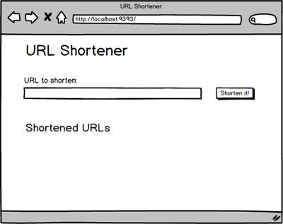
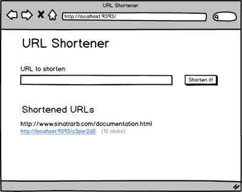

# URL Shortener

## Summary
We're going to build a [Bitly][] clone.  What does Bitly do?  URLs can be really long, which makes them difficult to share.  Bitly provides a service that creates shorter, friendlier URLs.  When users visit a shortened Bitly URL, the Bitly server responds by telling the browser to redirect to the original, longer URL.

Try it.  Click on this Bitly link:  [http://bit.ly/1dKgi4T](http://bit.ly/1dKgi4T).

What happened?  If we open the Network tab of the Developer Tools, and visit the Bitly link again, we'll see that the response from the Bitly server has a status of [301][wikipedia 301].  If we look a little deeper and look at the response headers, we'll see that a location header specifies for the browser where to go.

While building this web application, our focus is going to be on events related to the life cycle of an Active Record model.  What happens when when an Active Record model is instantiated, saved, validated, etc.?  We'll be using Active Record [callbacks][rails guides callbacks] around these life cycle events to control our objects and their data.

### HTTP Status Codes
Each HTTP transaction must return a status code.  One we're probably familiar with is `404` (Not Found!).  As we building our application, we should investigate which HTTP codes are sent for a static page and for a redirect.  Spend some time getting to know [HTTP status codes][]. It's common to be asked about them in interviews.  It might be easier to memorize them with help from [HTTP status cats][].

## Releases
### Release 0: Build the MVP
  
*Figure 1*.  Mockup of URL Shortener application.

In Figure 1 we have an animation that demonstrates how our application works.  On the homepage is a form where users input a URL.  When the form is submitted, our application persists an object representing the URL.  Objects representing submitted URLs are displayed on the homepage—both the original and shortened URLs.  When a user visits the shortened URL, they are redirected to the original URL.

We'll need one resource for our application:  a `Url` model.  Our model should have two attributes:  a long URL and a short URL.  We'll be creating our `Url` objects based on user input.  Users will provide us with the long URL.  We'll need to create the short URL—use a `before_save` callback in the `Url` model.

*Note:*  The necessary route handlers have been setup for us, but we need to complete them.

### Release 1:  Count Requests for each Short URLs
Users are happy with our URL shortening service, but they have requested an additional feature.  When they share a shortened link, they want to know how many times the shortened link is used.

We need to update our application to maintain a count of how many times it receives a request for each short URL.  To complete this feature, we'll need to ...

- update our database table to keep track of visits for each URL.
- update the appropriate route handler, so that any time a short URL is requested, the counter for the appropriate `Url` is updated.
- update the homepage to display the number of times each short URL was requested ([mockup](readme-assets/counter.png)).

### Release 2:  Validate URLs
We've received some user feedback saying that our short links are broken, sending users to bad URLs.  We've looked into the issue and noticed that users are supplying incomplete URLs.  For example, the user submits "google.com" rather than "http://google.com".  In other words, the problem is with the user input, but it looks like the problem is on our end, and of course, we need to do something about it.

If a user submits an invalid URL, we don't want to provide them with a short URL; instead, we want to alert them to the problem and provide the opportunity to correct the input (see Figure 2).  To accomplish this, we'll add an [Active Record validation][ActiveRecord validations] to our `Url` model.  There are different approaches to determining what constitutes a valid URL.  For our purposes, we'll say that a valid URL begins with "http://" or "https://".

  
*Figure 2*.  Alerting users that a URL is invalid.

As we've learned in [previous challenges][validations intro challenge], when we attempt to save, create, or update an Active Record object, Active Record will first validate the object.  If any validations fail, the object is invalid, and Active Record will not try to write to the database.  But, for each failing validation, Active Record will note the failure in the object's [errors][].  We should leverage our understanding of validations and errors to update the route handler in which we persist `Url` objects.

## Optimize Your Learning

### More on Validations, Constraints, and Database Consistency

We often want to put constraints on what sort of data can go into our database.
This way we can guarantee that all data in the database conforms to certain
standards, e.g., there are no users missing an email address.  Guarantees of
this kind &mdash; ensuring that the data in our database is never confusing or
contradictory or partially changed or otherwise invalid &mdash; are called
**consistency**.

If we think of this as a fact from Fact Land, these constraints look like:

* A user must have a first\_name
* A user must have an email
* Two user's can't have the same email address, or equivalently, each user's email must be unique
* A Craigslist post's URL must be a valid URL, for some reasonable definition of valid

These facts can be recorded in both SQL Land and in Ruby Land, like this:

<table class="table table-bordered table-striped">
  <tr>
    <th>Fact Land</th>
    <th>SQL Land</th>
    <th>Ruby Land</th>
  </tr>
  <tr>
    <td>A user must have an email address</td>
    <td><code>NOT NULL</code> constraint on <code>email</code> field</td>
    <td><code>validates :email, :presence => true</code></td>
  </tr>
  <tr>
    <td>A user must have a first name</td>
    <td><code>NOT NULL</code> constraint on <code>first_name</code> field</td>
    <td><code>validates :first_name, :presence => true</code></td>
  </tr>
  <tr>
    <td>A user's email address must be unique</td>
    <td><code>UNIQUE INDEX</code> on <code>email</code> field</td>
    <td><code>validates :email, :uniqueness => true</code></td>
  </tr>
</table>

## Resources

* [Bit.ly, a url shortening service][bitly]
* [ActiveRecord validations][]
* [URI module][]
* [Active record custom validations][custom validations]
* [ActiveRecord create][create]
* [ActiveRecord save][save]
* [ActiveRecord's valid? &amp; invalid?][valid invalid]
* [ActiveRecord's errors object][errors]
* [HTTP status codes][]
* [HTTP status cats][]

[ActiveRecord validations]: http://guides.rubyonrails.org/active_record_validations.html
[bitly]: http://bitly.com/
[errors]: http://guides.rubyonrails.org/active_record_validations.html#working-with-validation-errorsactive_record_validations.html#validations-overview-errors
[HTTP status codes]: http://en.wikipedia.org/wiki/List_of_HTTP_status_codes
[HTTP status cats]: http://httpcats.herokuapp.com/
[rails guides callbacks]: http://guides.rubyonrails.org/active_record_callbacks.html
[validations intro challenge]: ../../../active-record-intro-validations-challenge
[wikipedia 301]: https://en.wikipedia.org/wiki/HTTP_301

[URI module]: http://www.ruby-doc.org/stdlib-1.9.3/libdoc/uri/rdoc/URI.html
[custom validations]: http://guides.rubyonrails.org/active_record_validations.html#performing-custom-validations
[create]: http://apidock.com/rails/ActiveRecord/Base/create/class
[save]: http://apidock.com/rails/ActiveRecord/Base/save
[valid invalid]: http://guides.rubyonrails.org/active_record_validations.html#valid-questionmark-and-invalid-questionmark

